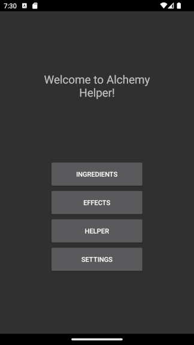
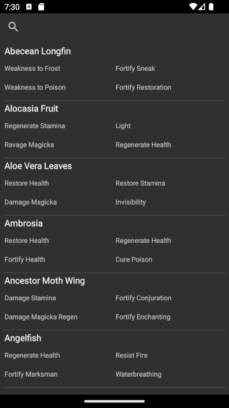
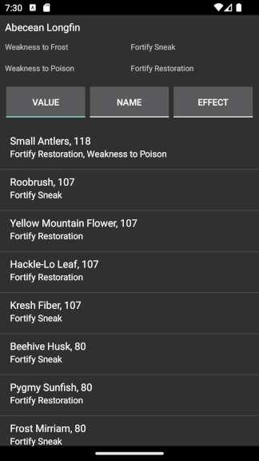
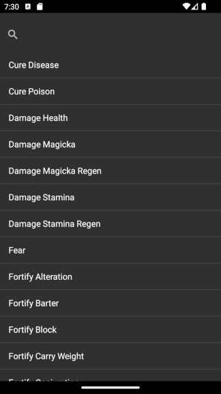
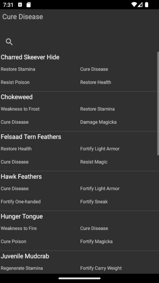
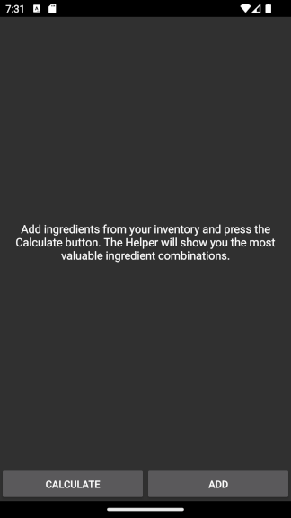
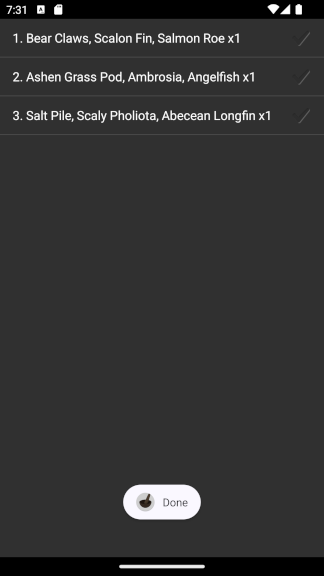
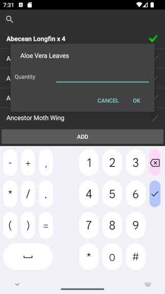
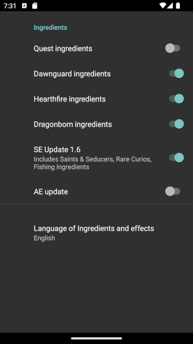

# Skyrim Alchemy Helper App Documentation
## Desciption

This is a small Android application that allows you to view the alchemy ingredient or effects of the video game [The Elder Scrolls V: Skyrim](https://store.steampowered.com/app/489830/The_Elder_Scrolls_V_Skyrim_Special_Edition/).
This app's primary goal was to be able to check alchemy data without 'alt-tabbing' all the time.
## Installation
1. Go to the release section.
2. Download the latest version.
3. Copy to your Android device.
4. Install

## Usage

### Ingredients section

  
   

This section contains data on alchemy ingredients. You can filter ingredients by name using the search button.
If you click on an ingredient, you can see possible potion candidates; you can sort these candidates by price, mix candidate name, and effect name. The price calculation may be inaccurate depending on your character's level. The price is calculated assuming your character has no perks or levels in the Alchemy skill.
### Effects section

  
   

This section contains data on alchemy effects. You can filter effects by name using the search button.
If you click on effect, you can see a list of ingredients with that effect. This list may be filtered by name using the search button.
### Helper section

  
   
   

This section allows users to add effects and sort all possible potions based on price. Please note the price is calculated assuming your character has no perks or levels in the Alchemy skill. So sorting order may be different than in actual game.

#### Adding ingredients
1. Click on the 'Add' button.
2. Click on the desired ingredient name once to add one instance of that ingredient. Long tap to manually input the quantity of the ingredient.
3. Click on 'Add'.

#### Launching calculation
1. Click on the 'Calculate' button.
2. Wait until the calculation is finished. Please note calculation may take some time.
### Settings section

In this section you can exclude certain types of ingredients from the ingredient list by toggling off the category.
You can change the language of ingredient and effect names. Supported languages:
- English
- French
- German
- Italian
- Polish
- Russian
- Spanish
- Chinese
- Japanese
